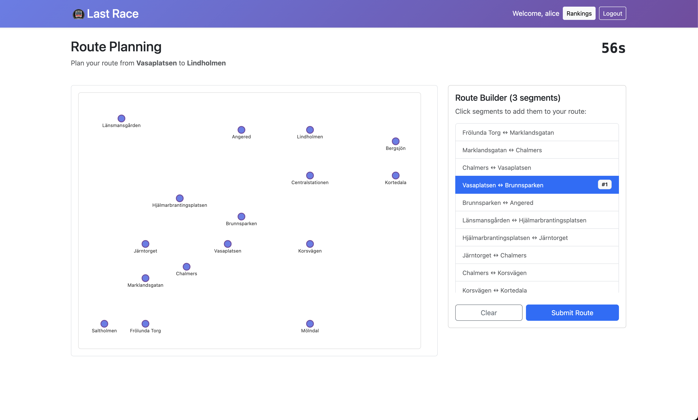
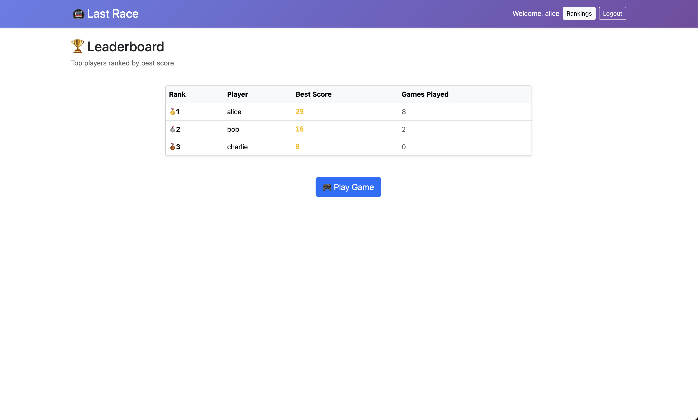

# Last Race — Metro Routing Game
## Student: s123456 Persson Jesper

## React Client Application Routes
- `/` — Login page (sign in form).
- `/instructions` — Game rules and instructions.
- `/setup` — Network overview and 'Start Game' option.
- `/plan` — Route planning UI (select segments in order; 90s timer).
- `/execute` — Execution playback showing events and coin changes.
- `/result` — Final result and score breakdown.
- `/rankings` — Global leaderboard.

## API Server
- POST `/auth/login` — body `{ username, password }`, response `{ success: true, user: { id, username } }` on success.
- POST `/auth/logout` — (authenticated) logs the user out, response `{success: boolean}`
- GET `/auth/status` — returns `{ authenticated: boolean, user?: { id, username } }`.
- GET `/api/network` — returns the full metro network: `{ lines: [], stations: [], segments: [] }`.
- GET `/api/game/new` — (authenticated) create a new game session; response: `{ gameId, startStation: {id,name}, destinationStation: {id,name}, initialCoins, timeLimit }`.
- POST `/api/game/play` — (authenticated) submit and execute a route. Body: `{ gameId: number, segments: number[] }`. Response: `{ gameId, isValid: boolean, reason?: string, finalScore: number, events: [{ segmentId, event, coinEffect, coinsAfter }] }`.
- GET `/api/rankings` — (authenticated) leaderboard: response `{ rankings: [{ rank, id, username, best_score, game_count }, ...] }`.

## Database Tables
- `users`: contains: `id`, `username`, `password_hash`.
- `lines`: contains: (`id`, `name`, `color`).
- `stations`: contains: (`id`, `name`, `x`, `y`).
- `segments`: contains: (`id`, `station_a_id`, `station_b_id`, `line_id`).
- `events`: contains: (`id`, `description`, `coin_effect` between -4 and 4).
- `games`: contains: (`id`, `user_id`, `start_station_id`, `destination_station_id`, `submitted_route`, `is_valid`, `final_score`, `created_at`).

## Main React components
- `Header` (`client/src/components/Header.jsx`): app header and navigation.
- `NetworkVisualization` (`client/src/components/NetworkVisualization.jsx`): renders the map (lines, stations, segments).
- `GameContext` (`client/src/contexts/GameContext.jsx`): handles network loading, starting games and submitting routes.
- `UserContext` (`client/src/contexts/UserContext.jsx`): auth state, login/logout and auth check.
- Page components: `LoginPage`, `InstructionsPage`, `SetupPage`, `PlanPage`, `ExecutePage`, `ResultPage`, `RankingsPage` (in `client/src/pages/`).

## Screenshot
during game

leaderboard

## User Credentials
- `alice`, `password1`
- `bob`, `password2`
- `charlie`, `password3`

## Use of AI
AI assistance was used during the development of this application, primarily utilizing Claude 3.5 Haiku integrated within GitHub Copilot. Since the AI often generates unnecessary code, all AI-generated suggestions were carefully reviewed, filtered, and manually adapted to fit the project.